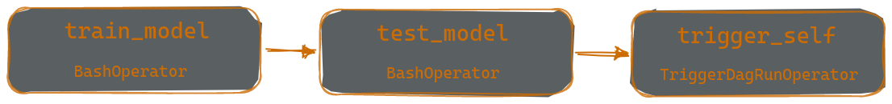
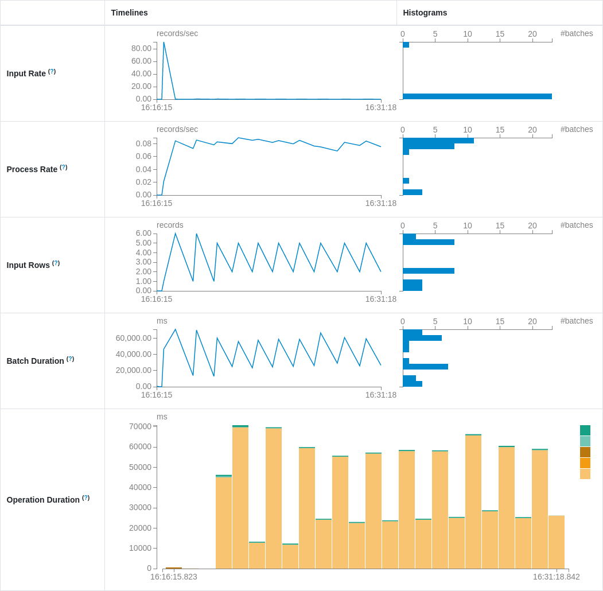

# Tone of Comments

## About
### Introduction
This is a pet project I am making for the purpose of learning and gaining practical experience with **Spark**, **Kafka**, **Hive**, and **Airflow**. Its main objective is to predict the sentiment of comments posted on YouTube videos.


By using the functionality of **Kafka** and **Spark**, the project can be extended to use multiple prediction models and message sources simultaneously.

### How it works
A **FastAPI** web application obtains comments from an API and produces them as `protobuf` messages into the `comments` **Kafka** topic in batches where hashed comments are used as keys for **Kafka** messages. The application then waits for predictions to be received in the `emotions` topic. **Confluent Kafka** library is used to produce and receive messages. A **Spark Streaming** application is used to load the comments from the `comments` topic, predict the emotions using a UDF, and produce the predictions as messages into the `emotions` topic. After the predictions are produced, the web application loads the predictions and visualizes them. Additionally, the predictions are saved to a **Hive** table with a separate script. The web application, Spark Streaming application, and a script for Hive are initiated through the `start_app` **Airflow** DAG.

### Model Training
Training is done by the `train` **Airflow** DAG. **Weights & Biases** is used for visualization of the training process and storage of the model and dataset artifacts.

[Weights & Biases Project Page](https://wandb.ai/molokhovdmitry/tone_of_comments)

Training DAG:


The `train_model` task preprocesses the data and trains the model, while the metrics are logged to **Weights & Biases**. Early stopping is used to stop the training process, and the model with the highest validation score is saved to **wandb** with the `latest` alias.

The `test_model` task loads the model with the `latest` alias. If there is an existing model with `best` alias, F1 score of that model is loaded. The model is evaluated on the `test set` and the metadata of the model is updated with the scores on **wandb**. If the F1 score of the evaluated model is better than that of the `best` model, the evaluated model is saved to **wandb** using the `best` alias.

The `trigger_self` task just restarts the DAG for continuous training.

### Spark Application
The Spark streaming application loads the model from the **wandb** project with the `best` alias and uses it for inference. The project could be extended to use multiple Spark applications.

Currently, it uses the **SpanEmo** model to predict emotions of the comments.

[GitHub](https://github.com/hasanhuz/SpanEmo), [Paper](https://www.aclweb.org/anthology/2021.eacl-main.135.pdf)

Streaming Query Statistics Example:


## Installation and Running
### 1. Create conda environment.
```
conda create --name tone_of_comments python=3.8
conda activate tone_of_comments
pip install -r requirements.txt
```
### 2. Install [Java](https://www.java.com/en/download/help/index_installing.html), [Hadoop](https://hadoop.apache.org/docs/stable/hadoop-project-dist/hadoop-common/SingleCluster.html), [Spark](https://spark.apache.org/docs/latest/index.html), [Hive](https://cwiki.apache.org/confluence/display/Hive/GettingStarted), [Kafka](https://kafka.apache.org/quickstart), [Airflow](https://airflow.apache.org/docs/apache-airflow/stable/installation/index.html#using-pypi).

Versions used:
```
- Java 1.8.0_361
- Hadoop 3.3.5
- Spark 3.3.2
- Hive 3.1.3
- Kafka 3.4.0
- Airflow 2.6.0
```
### 3. Setup **Airflow**.

In `airflow.cfg` set the `dags_folder` to an absolute path to `dags` folder and `executor` to `LocalExecutor`.
[Set up](https://airflow.apache.org/docs/apache-airflow/stable/howto/set-up-database.html)
**Airflow** Database Backend to use **MySQL** / **PostgreSQL** / **MsSQL**.

### 4. Add these environment variables:
```
conda env config vars set PYSPARK_DRIVER_PYTHON=$(which python)
conda env config vars set PYSPARK_PYTHON=$(which python)
```
### 5. Login to **wandb**.
```
wandb login
```
### 6. Start ZooKeper and Kafka broker services.
```
bin/zookeeper-server-start.sh config/zookeeper.properties
```
```
bin/kafka-server-start.sh config/server.properties
```
### 7. Start **Hadoop**.
```
sbin/start-all.sh
```
### 9. Start **Hive**.
```
bin/hive --service metastore
```
```
bin/hive --service hiveserver2
```
### 8. Start **Airflow**.
```
airflow webserver
```
```
airflow scheduler
```
### 9. Trigger the `train` DAG in **Airflow** interface to start the training or the `start_app` DAG to start the app at `localhost:8000`.
